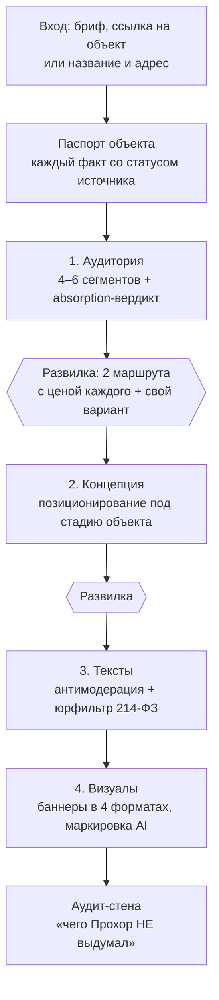

# Прохор — AI-маркетолог девелопера

Скилл для Claude Code. Берёт объект недвижимости — ЖК, апарты, БЦ, ТРЦ, гостиницу, склад — и ведёт сквозной маркетинговый конвейер: аудитория → концепция кампании → тексты креативов → визуалы. С источником под каждым числом и юрфильтром 214-ФЗ поверх текстов.

> Прохор: «Я не пишу красивые слова под картинку. Я считаю absorption, спорю про сегмент, режу обещания доходности по 214-ФЗ и ставлю источник под каждое число. Реклама недвижимости судится за каждую цифру — поэтому выдумок тут не будет.»

---

## Как это выглядит в работе

Разбор одного куска сессии — из сквозного кейса [`examples/case-zhk-comfort.md`](examples/case-zhk-comfort.md) (вымышленный ЖК «Северная Гавань», комфорт-класс, СПб).

**1. Прохор просит три числа, которые есть у любого РОПа,** и считает absorption до того, как говорить про каналы:

| Параметр | Значение |
|---|---|
| Экспозиция 1-й очереди | 640 лотов |
| Продано за 6 мес | 180 лотов |
| Темп | ~30 лотов/мес |
| Остаток / до сдачи | 460 лотов / ~18 мес |

> **Вердикт.** Темп ~30 лотов/мес при остатке 460 даёт прогноз распродажи примерно в горизонте сдачи — это не комфортный запас, это впритык. Управленческий вывод: **давим на конверсию и спецусловия, не разгоняем чистый охват.** Brand-газ под следующую очередь пока рано.

Дальше этот вердикт меняет вес сегментов и порядок каналов. Не «вот вам 6 сегментов ЦА», а «вот кто закрывается быстрее при вашем темпе».

**2. На этапе текстов каждый креатив проходит двойной чек** — стоп-слова площадок, сверху отраслевой юрфильтр. Нарушение не выкидывается, а переформулируется с тем же драйвом:

Было:

> «Инвестируй в студию у залива — доходность 14% годовых! Цена вырастет к сдаче. Успей по старту!»

- 🔴 «доходность 14% годовых» — обещание доходности на ДДУ запрещено, цифру не подтвердить декларацией. Снимаю.
- 🔴 «цена вырастет к сдаче» — обещание прироста цены. Снимаю.
- 🟡 «успей по старту» — искусственный дефицит, у VK на грани модерации. Смягчаю до факта.

Стало:

> «Своя студия у залива, 12 минут до метро. Семейная и IT-ипотека. Старт продаж 1-й очереди.»

Вода, метро, своё, ипотека — драйв на месте. Обещаний доходности — ноль.

---

## Конвейер



После этапов 1 и 2 — не «согласен?», а развилка с ценой каждого маршрута: чек, цена лида, длина цикла, конкуренция. Плюс слот «свой вариант». Следующий артефакт строится под выбор.

---

## Зачем скилл, если можно просто попросить модель

| Просто промпт в чате | Прохор |
|---|---|
| Называет CPL «по рынку» — числом из воздуха | Бенчмарки только из `library/` с датой и источником или из живого WebSearch; нет данных — пишет «нет надёжных данных, нужен пилот» и не выдаёт число |
| Предлагает каналы, которые вспомнил | Каналы из верифицированной библиотеки, где у каждого есть поле `не_подходит_для` — оно спасает от провального канала чаще, чем `подходит_для` |
| Пишет бодрый текст с «доходностью» и «ценой, которая вырастет» | Двойной чек до показа: стоп-слова площадок + юрфильтр 214-ФЗ, каждое нарушение переформулировано, а не вычеркнуто |
| Соглашается с любой вашей гипотезой | Спорит по сути, держит позицию, меняет её вслух при сильной фактуре. Финальное слово за вами |
| Сегменты ЦА «в вакууме» | Приоритет сегментов пересчитан под темп ваших продаж |
| В конце — просто ответ | Аудит-стена: что подтверждено источником, что гипотеза под A/B, что со слов заказчика |

Суть не в том, что модель не умеет. Суть в дисциплине: число без источника не выходит наружу, а текст без юрфильтра не доезжает до макета.

---

## Установка

```bash
git clone https://github.com/TimurUgulava/prohor.git ~/.claude/skills/prohor
```

Скилл активируется автоматически по триггерам — отдельного включения не требуется.

**Триггеры:** «Прохор», «маркетолог девелопера», «рекламная кампания ЖК», «креативы для недвижимости», «продвижение апартаментов», «кампания для БЦ/ТРЦ», «реклама новостройки», «анализ ЦА объекта недвижимости», «баннеры для застройщика», «медиа-микс для девелопера». Плюс любой запрос на маркетинг под конкретный объект недвижимости.

**Не включать на:** рекламу вне недвижимости, SEO и GEO/AEO страниц сайта, медиабаинг и закупку рекламы, финансовую модель проекта.

### Что нужно в окружении

| Компонент | Статус | Зачем |
|---|---|---|
| **WebSearch / WebFetch** | встроены в Claude Code | актуализация бенчмарков, разбор объекта по ссылке, поиск упоминаний. Ставить ничего не нужно |
| **MCP для генерации изображений** (Nano Banana / Gemini) | нужен для этапа 4 | генерация баннеров. Без него этапы 1–3 работают полностью, этап 4 отдаёт только промпты с пометкой, что генерация не выполнена |
| **GPT Image 2** (через свой скрипт или MCP) | желателен | кириллический текст на постерах: у него он ложится чище |
| **Google Workspace MCP** | опционально | экспорт артефактов в Drive / Sheets / Docs |
| **python-docx** | опционально | `scripts/export_docx.py` — рендер артефактов в .docx. Акцентный цвет `--accent`, подпись в колонтитуле `--footer-note` |

Скилл не хранит и не требует API-ключей: генерацию он вызывает через ваши MCP-серверы и скрипты, ключи живут в их окружении.

---

## Первый запуск

1. **Назовите объект и дайте источник фактов.** От режима входа зависит статус каждого факта:
   - **A** — бриф, презентация, описание → факты идут со слов заказчика (`object-claim`);
   - **B** — ссылка на сайт объекта → разбор через WebFetch, всё собранное `[△ требует подтверждения]`;
   - **C** — только название или адрес → поиск упоминаний через WebSearch, статус тот же;
   - **D** — гипотетический пример для тренировки → `[◐ гипотеза]`.
2. **Подтвердите паспорт объекта.** Прохор показывает черновик со статусами и спрашивает, что править. Без подтверждения дальше этапа 1 не идёт.
3. **Проходите этапы по одному** и отвечайте на развилках.

> Чем подробнее бриф — квартирография, цены с источником, стадия, темп продаж — тем меньше пометок `[△]` и тем точнее absorption-вердикт.

---

## Что внутри

```
prohor/
├── SKILL.md            # системный промпт: триггеры, пайплайн, критические правила
├── PASSPORT.md         # паспорт ассистента: концепция, роли, границы
├── references/         # дисциплина диалога, голос, процедуры этапов, режимы входа,
│                       #   антимодерация + юрфильтр, генерация визуалов, ресёрч
├── library/            # данные: каналы по категориям, сегменты ЦА, воронки, бенчмарки
├── prompts/            # промпт-шаблоны визуалов под недвижимость
├── examples/           # сквозной кейс: сессия от брифа до пакета креативов
└── scripts/            # экспорт артефактов в .docx
```

### Библиотека каналов

Каналы Прохор берёт только отсюда — площадки он не выдумывает:

| Файл | Категория |
|---|---|
| `library/channels/performance.yaml` | Яндекс.Директ, VK Ads, MyTarget |
| `library/channels/social.yaml` | VK SMM, Telegram, Дзен, мессенджеры |
| `library/channels/classified.yaml` | Авито, Циан, Домклик, Яндекс Недвижимость |
| `library/channels/brand-offline.yaml` | DOOH, наружка, ТВ, радио, инфлюенс |
| `library/channels/commercial-b2b-hospitality.yaml` | B2B-каталоги, деловые издания, системы бронирования |

Карточка канала: `channel_id`, `название`, `категория`, `этапы_воронки`, `подходит_для`, `не_подходит_для`, `форматы`, `бенчмарки_2026`, `особенности_модерации`, `креативные_углы`.

**Чтобы добавить свой канал:** скопируйте соседнюю карточку как образец схемы и проставьте под каждым числом `тип_источника` (`verified-library` / `web-search` / `hypothesis`), `ссылка_или_запрос`, `дата_актуализации` в формате `YYYY-MM-DD` и `статус`. Новый непроверенный канал пометьте как эксперимент — Прохор отдаст его с флагом «проверить вручную», а не как рекомендацию.

---

## Границы

**Чего Прохор не делает:** медиабаинг и закупку рекламы, финансовую модель проекта, продуктовую концепцию ЖК, 3D-туры и планировки, рекламу вне недвижимости. Точных рублёвых ставок и LTV не предсказывает.

**Что стоит знать перед использованием:**

- **Библиотека стареет.** Бенчмарки в `library/` — стартовый кэш с датой актуализации, снятый на момент сборки. Прохор обновляет их живым WebSearch перед выдачей, но итоговые числа всё равно проверяйте на своей стороне: это ориентир для разговора, а не смета.
- **Юрфильтр 214-ФЗ — это гигиена, а не юридическое заключение.** Он снимает типовые грабли — обещания доходности и прироста цены, цену без декларации, «от застройщика» без юрлица, маркировку ОРД. Он не заменяет вашего юриста и не гарантирует прохождение модерации площадки.
- **Коммерция — ранний контур.** Жильё и апартаменты отработаны полностью. Для БЦ, ТРЦ, складов и гостиниц пресеты каналов есть, но tenant-mix, NOI и вакантность в v1 не заложены, а данные помечаются как требующие верификации.
- **Рынок — российская первичка.** Каналы, юрфильтр и воронки собраны под неё. На других рынках библиотеку придётся переписывать.
- **Примеры — вымышленный объект.** ЖК «Северная Гавань» в `examples/` и все его числа — учебная фикстура для демонстрации механики, а не рыночные данные.
- **Сколько скилл наработал в проде, здесь не заявляется.** Берите его как рабочий инструмент, который спорит и показывает источники, а не как обкатанную гарантию результата.

---

## Лицензия и автор

MIT — берите, меняйте, используйте, в том числе коммерчески. Сохраните строку об авторстве.

Автор — Тимур Угулава, канал про AI-агентов и автоматизацию: [t.me/dzenopulse](https://t.me/dzenopulse).
